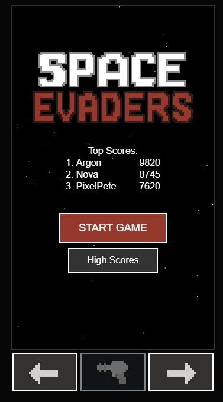
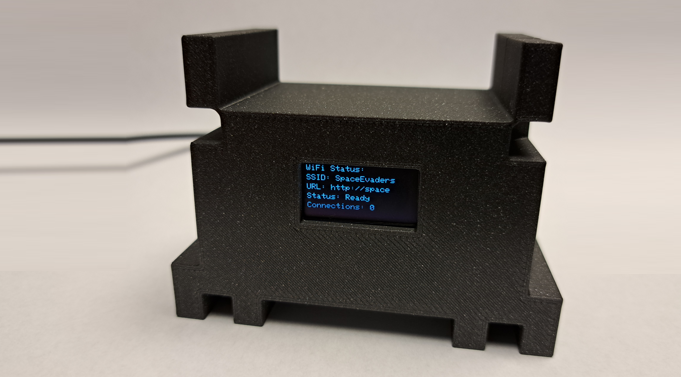
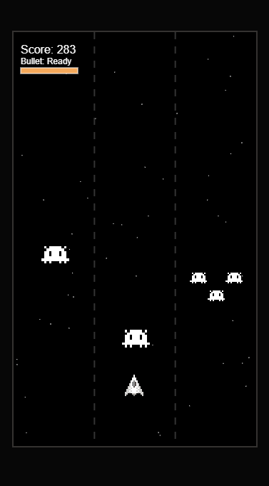
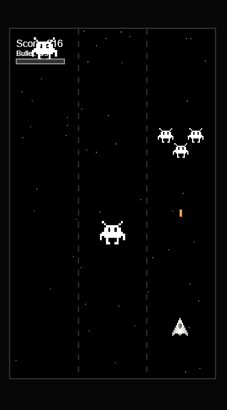
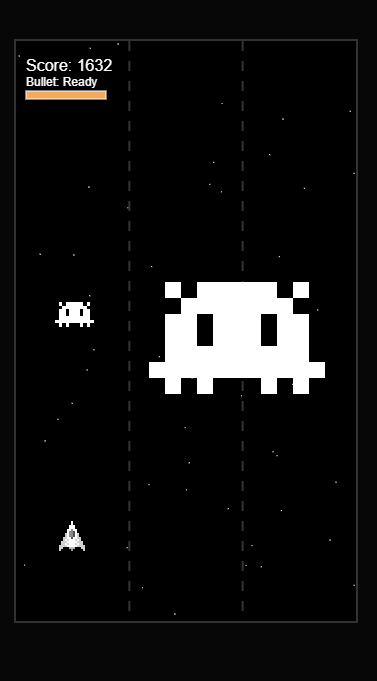
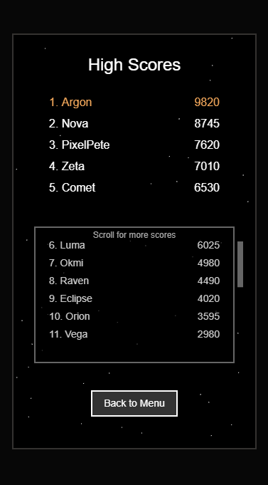
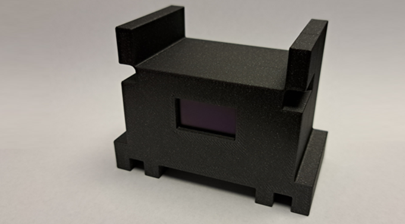

# SpaceEvaders

A fast-paced, lane-based arcade shooter playable directly in your browser—hosted from an ESP32. Featuring pixel-perfect sprites, boss battles, highscore tracking, and a captive-portal style Wi‑Fi AP for true “plug-and-play” gaming. If you rank in the top 3, your name appears on the OLED screen. It’s a local “online” competitive experience, perfect with friends or at parties.



- Web client: HTML/CSS/JS in `platformio/data`
- Firmware: ESP32 (Arduino) in `platformio/src`
- Local dev server: Flask app `server.py` with `/api/highscores`

 


## Features

- 3 lanes with smooth lane switching and one-bullet gameplay
- Waves and boss encounters that occupy two lanes, leaving only one free
- Intelligent spawns and special V-formation mini enemies (3 minis)
- Anti-edge-case safety: special minis won’t spawn too close to the boss in the free lane; drift-ins are auto-cleared to avoid unwinnable states
- Bullet award system for dodging enemies; challenge mode that ramps difficulty near your personal best
- Pixel-perfect rendering for sprites and explosions; crisp scaling
- ESP32 SoftAP with captive-portal endpoints and static file serving from LittleFS
- Highscores stored locally on the server or on-device, with safe, atomic writes on ESP32
- Up to 10 AP stations (ESP32 maximum) configurable in firmware

<p align="center">
  
  
</p>

<p align="center">
  
  
</p>

## Project structure

```
.
├─ platformio/
│  ├─ platformio.ini           # PlatformIO config (board: esp32dev)
│  ├─ src/
│  │  └─ main.cpp              # ESP32 firmware (WiFi AP, server, LittleFS, OLED)
│  ├─ data/                    # Web client (served both locally and on-device)
│  │  ├─ index.html
│  │  ├─ script.js             # Game logic (spawning, boss, collisions, UI)
│  │  ├─ style.css
│  │  ├─ js/
│  │  │  ├─ main.js            # Module entry: imports script.js
│  │  │  ├─ config.js          # Tunable game constants (lanes, speeds, scales, etc.)
│  │  │  ├─ sprites.js         # Sprite loading
│  │  │  └─ collision.js       # Bounds & pixel-perfect collision helpers
│  │  ├─ img/                  # Assets
│  │  └─ highscore.json        # Highscore storage (local dev or initial on-device)
│  └─ (LittleFS filesystem is built from this folder)
├─ server.py                   # Local Flask dev server + REST API
├─ STL/                        # 3D prints for case
├─ LICENSE
└─ README.md
```

## Gameplay (controls)

- Keyboard: Left/Right and A/D to change lanes, Space to start/shoot
- Touch: on‑screen left/right/shoot buttons
- Goal: Survive waves, dodge or shoot enemies, pass bosses via the free lane. Bullets are limited—earn one by dodging a number of enemies.


## Local development

Requirements: Python 3.10+ (tested with 3.12), pip

1) Create a venv and install server deps

```powershell
python -m venv .venv
. .venv/Scripts/Activate.ps1
pip install -r platformio/data/requirements.txt
```

2) Run the dev server
```powershell
python server.py
```
- Open http://127.0.0.1:5000
- The server prefers `platformio/data` for assets; 

Highscores are served/saved via `/api/highscores` (see API below). The server writes to `platformio/data/highscore.json` by default.

## ESP32 firmware (PlatformIO)
Requirements: PlatformIO (CLI or the VS Code extension)
Build from repo root using the installed PlatformIO CLI in venv:

```powershell
# Build (from repo root)
. .venv/Scripts/Activate.ps1
.venv\Scripts\platformio.exe run -d platformio -e esp32dev
```

Upload firmware:
```powershell
.venv\Scripts\platformio.exe run -d platformio -e esp32dev -t upload
```

Upload LittleFS (web assets):
```powershell
.venv\Scripts\platformio.exe run -d platformio -e esp32dev -t uploadfs
```

Serial monitor (115200 baud):
```powershell
.venv\Scripts\platformio.exe device monitor -d platformio -b 115200
```

**Alternative: Using PlatformIO CLI or VS Code extension (simpler)**
If you have PlatformIO installed globally (via `pip install platformio` or the VS Code extension), navigate to the `platformio/` directory and run:

```powershell
cd platformio

# Build firmware
pio run -e esp32dev

# Upload firmware to connected ESP32
pio run -e esp32dev -t upload

# Upload web assets (LittleFS filesystem)
pio run -e esp32dev -t uploadfs

# Monitor serial output (115200 baud)
pio device monitor -b 115200
```

### Firmware highlights

- SoftAP with captive-portal DNS; serves static files from LittleFS
- REST endpoints:
  - GET `/api/highscores` → `{ highscores: [...] }`
  - POST `/api/highscores` → accepts single score or `{ highscores: [...] }`
  - GET `/api/connections` → `{ activeConnections, maxConnections }`
- Highscore writes are safe and atomic:
  - Protected by a FreeRTOS mutex
  - Write to temp file then rename to final to avoid partial/corrupt saves
- OLED (optional) shows Wi‑Fi and top scores (can be disabled)

## API

Base URL:
- Local dev: `http://127.0.0.1:5000`
- On-device: `http://space` (captive DNS) or AP IP `http://192.168.4.1`

GET `/api/highscores`
- Response: `{ "highscores": [ { name, score, date, playerFingerprint }, ... ] }`

POST `/api/highscores`
- Accepts either a single entry or a bulk payload:

```json
{ "name":"Player", "score":12345, "date":"2025-01-01T00:00:00Z", "playerFingerprint":"abcd1234" }
```

```json
{ "highscores": [ { "name":"A", "score":1000 }, { "name":"B", "score":900 } ] }
```

GET `/api/connections`
- Response: `{ "activeConnections": n, "maxConnections": 10 }`

## License

This project is licensed under the Apache License 2.0 — see the [LICENSE](LICENSE) file.

---

  

Made with love for tiny arcades. Check out the `STL/` folder for printable parts.
